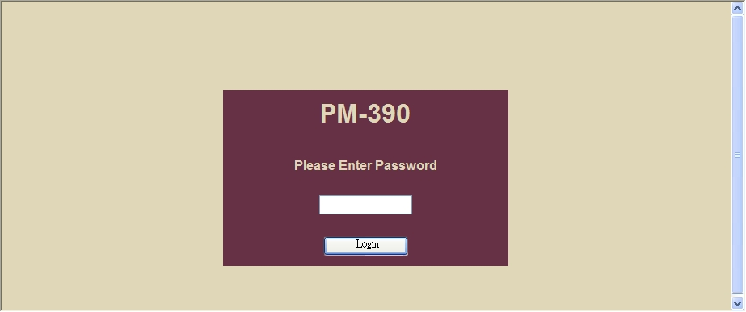
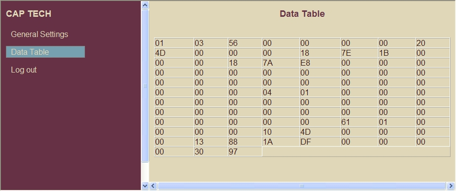
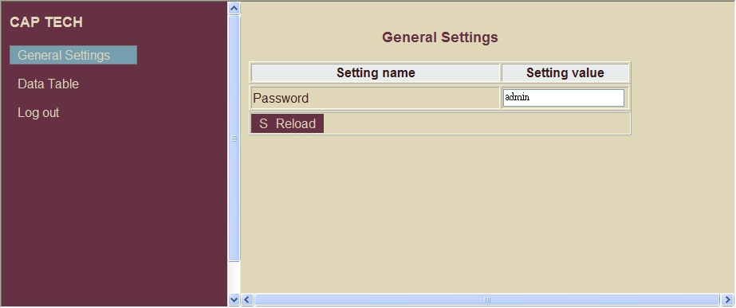

# Communicating with an Energy Meter in Modbus

## About the Application

This is a quick demo we've put together to allow network access to the CAPTECH PM390 Multifunction Power Meter ([Product page](http://www.captech.com.tw/ev/prod/prod4/))

One of our potential Customers wanted to us to create a small Tibbo BASIC app that would query the meter and show the data on a simple HTML page. Two hours later (spent mostly on connecting and arranging things) we had a working application prototype.

## How It Works

1. When you load the program into the EM1000TEV for the first time, you need to press the MD button to initialize the EM1000TEV. The system will reboot.
2. Once the system has been initialized, it will boot up and pull the state of the power meter by sending the request on system timer.
3. Now access the webpage using the address you see on the LCD. The default password is **admin**. The web page will now show you data from the meter, and when you refresh it, it will show new data (polled periodically).

## Additional Features

We've thrown in a few additional features for ease of use, mainly by quickly adding Tibbo BASIC libraries:

- DHCP support for fast demoing
- Using the EM1000TEV, we can show the IP address of the TEV so that when demoing, it is easy to know what is the proper URL to put into the web browser.
- Password protected web page
- Utilizes multiple code libraries (html_commons, html_sessions, html_settings, dhcp, lcd_commons), and settings. 

 

 

